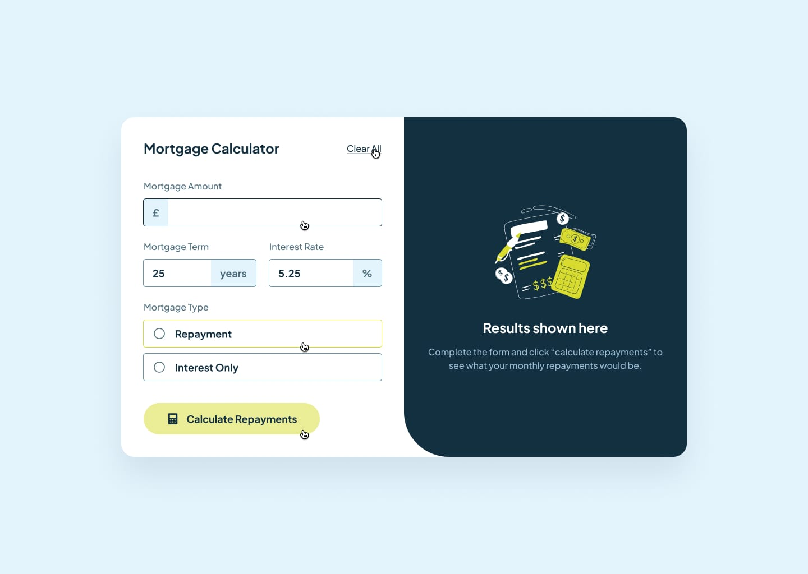

# 🏠 Mortgage Repayment Calculator

This is a solution to the [Mortgage Repayment Calculator challenge on Frontend Mentor](https://www.frontendmentor.io/challenges/mortgage-repayment-calculator-Galx1LXK73). This project helped me strengthen my **React** skills by building a real-world financial tool that dynamically calculates monthly and total repayments.

---

## 📋 Table of Contents

- [Overview](#overview)  
  - [Screenshot](#screenshot)  
  - [Live Links](#live-links)  
  - [Built With](#built-with)  
- [Author](#author)

---

## Overview

Users should be able to:

- Input mortgage amount, interest rate, and term  
- View monthly and total repayment results  
- Switch between interest-only and full repayment modes  
- See validation if any fields are missing or invalid  
- Navigate and interact fully using a keyboard  
- Experience a responsive layout on all screen sizes  
- View hover and focus states for all interactive elements

---

### Screenshot

---

### Live Links

- 📁 GitHub Repository: [Mortgage Repayment Calculator](https://github.com/vedantagrawal524/mortgage-repayment-calculator)  
- 🌐 Live Site: [https://mortgage-repayment-calculator524.vercel.app/](https://mortgage-repayment-calculator524.vercel.app/)

---

### Built With

- HTML5  
- TailWind CSS  
- JavaScript  
- React  
- Form validation  
- Responsive design  
- Mobile-first workflow  
- [Vercel](https://vercel.com/) for deployment

---

## Author

- Portfolio – _Vedant Agrawal_  
- Frontend Mentor – [@vedantagrawal524](https://www.frontendmentor.io/profile/vedantagrawal524)  
- GitHub – [@vedantagrawal524](https://github.com/vedantagrawal524)

---

📝 _Coded with logic, learning, and lots of testing. Contributions and feedback are welcome!_
